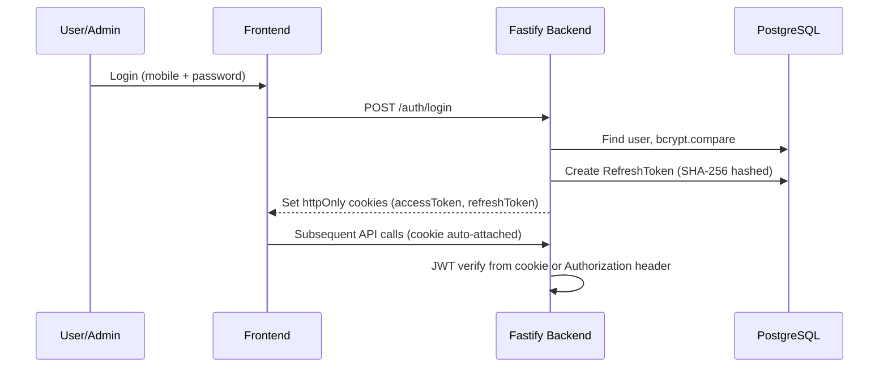
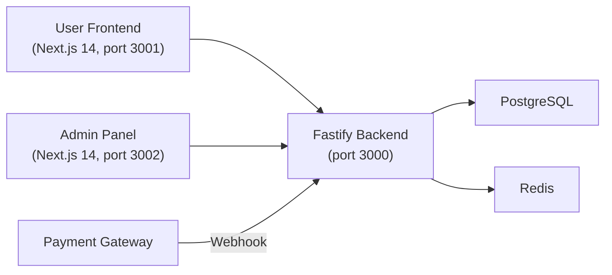

# Skill Era — Full System Security & Architecture Audit

**Date**: 2026-02-26  
**Scope**: Backend (Fastify), Admin Panel (Next.js 14), User Frontend (Next.js 14), Wallet Engine, Payout Engine, Tournament System, KYC, Infrastructure  
**Posture**: Fintech security auditor — real-money platform analysis

---

## PART 1 — SYSTEM SUMMARY

### What Has Been Built

| Layer | Tech | Status |
|---|---|---|
| **Fastify Backend** | Node.js + Fastify + Prisma + raw `pg` for financial ops | Production-hardened |
| **Admin Panel** | Next.js 14 App Router + TailwindCSS + httpOnly cookies | Built, secured |
| **User Frontend** | Next.js 14 App Router + TailwindCSS + React Query | MVP complete, build passing |
| **Database** | PostgreSQL (Prisma schema + raw SQL CTEs for financial atomicity) | Designed |
| **Auth** | JWT access/refresh tokens, TOTP 2FA for finance admins | Implemented |
| **Wallet Engine** | Deposit initiation → webhook confirmation → withdrawal → payout | Fully hardened |
| **Tournament** | 1v1 format: join (atomic fee deduction), prize distribution | Implemented |
| **KYC** | Submit → admin approve/reject workflow | Basic implementation |

### Authentication End-to-End



- **Access Token**: JWT signed with `JWT_ACCESS_SECRET`, 15-minute expiry, contains `{userId, role, type: 'access'}`
- **Refresh Token**: JWT signed with `JWT_REFRESH_SECRET`, 7-day expiry, stored as SHA-256 hash in DB
- **Cookie Management**: Backend sets httpOnly cookies; frontend uses `withCredentials: true`

### Financial Action Flow (UI → DB)

```
User clicks "Deposit" → Frontend POST /wallet/deposit/initiate
  → Backend creates Deposit record (status: initiated) with idempotency_key
  → Returns depositId to frontend
  → Payment gateway processes externally
  → Gateway sends webhook to POST /webhooks/deposit
  → Backend: HMAC-SHA256 verify → atomic CTE (lock wallet → credit balance → insert ledger → mark confirmed)
```

### Architecture Data Flow



---

## PART 2 — AUTHENTICATION & SESSION SECURITY

| # | Question | Answer | Evidence |
|---|---|---|---|
| 1 | Where are access tokens stored? | **httpOnly cookies** (admin panel) + **Authorization header** support (mobile/API). Frontend never stores in localStorage. | [authenticate.ts](file:///c:/Users/mohit/OneDrive/Desktop/again2/src/middleware/authenticate.ts#L30-L40) |
| 2 | How are refresh tokens handled? | SHA-256 hashed before DB storage. Full rotation with reuse detection. | [auth.service.ts](file:///c:/Users/mohit/OneDrive/Desktop/again2/src/modules/auth/auth.service.ts#L155-L203) |
| 3 | Are cookies httpOnly, Secure, SameSite? | **httpOnly**: ✅ Yes (set by backend). **Secure/SameSite**: ⚠️ **NOT VERIFIED** — the cookie-setting code was not found in the routes; backend must explicitly set these attributes. | See Risk #C1 below |
| 4 | Can XSS steal tokens? | **No** — httpOnly cookies cannot be read by JavaScript. Access token is never in localStorage. | ✅ |
| 5 | Can CSRF affect financial endpoints? | **⚠️ YES — No CSRF protection found.** All mutating endpoints rely solely on cookie auth. No CSRF token, no `SameSite=Strict` guarantee. | See Risk #C2 below |
| 6 | Does backend enforce CSRF protection? | **❌ No.** No CSRF middleware, no double-submit cookie pattern, no custom header requirement. | Critical gap |
| 7 | What happens if refresh token is stolen? | **Family-wide revocation** — if a revoked token is reused, ALL tokens for that user are revoked + monitoring event emitted. | [auth.service.ts:172-188](file:///c:/Users/mohit/OneDrive/Desktop/again2/src/modules/auth/auth.service.ts#L172-L188) ✅ |
| 8 | Is token rotation implemented? | **Yes** — old refresh token is revoked and `replacedById` links to new one. | [auth.service.ts:466-474](file:///c:/Users/mohit/OneDrive/Desktop/again2/src/modules/auth/auth.service.ts#L466-L474) ✅ |
| 9 | Is logout invalidating refresh token server-side? | **⚠️ Not verified** — no `/auth/logout` route was found in the codebase. If logout only clears cookies client-side, the refresh token remains valid for 7 days. | See Risk #M1 below |

---

## PART 3 — FINANCIAL SAFETY ANALYSIS

| # | Question | Answer | Verdict |
|---|---|---|---|
| 1 | Deposit flow end-to-end | Initiate → record with idempotency_key → webhook confirms → atomic CTE (lock wallet FOR UPDATE NOWAIT → credit → ledger insert → mark confirmed) | ✅ Solid |
| 2 | Duplicate deposit credit prevention | Idempotency: if deposit already `confirmed`, returns current balance without re-crediting. Status check inside locked row. | ✅ |
| 3 | Webhook replay prevention | HMAC-SHA256 timing-safe verification + idempotent `confirmDeposit` (returns cached result if already confirmed). | ✅ |
| 4 | Withdrawal double-processing | `payout_reference_id` unique constraint + atomic Prisma update with `status: 'approved', payoutReferenceId: undefined` guard. Concurrent requests get P2025/23505 error → 409 response. | ✅ |
| 5 | Idempotency | Deposit: `idempotency_key` unique index. Withdrawal: `idempotency_key` on withdrawal + ledger entries use `ON CONFLICT (idempotency_key) DO NOTHING`. | ✅ |
| 6 | Row-level locking | **Yes** — `SELECT ... FOR UPDATE NOWAIT` on both wallet and withdrawal rows in every financial CTE. | ✅ |
| 7 | Transaction isolation | Wallet ops: `READ COMMITTED` + `FOR UPDATE NOWAIT`. Payout commit: `SERIALIZABLE` + `FOR UPDATE NOWAIT`. | ✅ |
| 8 | Two admins approve same withdrawal simultaneously | `FOR UPDATE NOWAIT` inside transaction → second admin gets immediate failure (lock not available → `concurrentModification` error). | ✅ |
| 9 | Payout endpoint replay | Pre-check: if status is `paid` with existing `payoutReferenceId`, returns cached result with `idempotentReplay: true`. Terminal states (`paid`, `rejected`) block any further transitions. | ✅ |
| 10 | Fraud score evaluated before payout | **Yes** — `revalidateFraud()` called immediately before every gateway call. Checks: account status, fraud score vs threshold, unresolved fraud flags. | ✅ |

### Financial Safety Architecture Rating: **STRONG**

The wallet engine employs:
- Atomic CTEs with `FOR UPDATE NOWAIT` (no deadlock risk)
- `SERIALIZABLE` isolation for the payout commit path
- Double-entry ledger (`ON CONFLICT DO NOTHING` for idempotency)
- State machine with enforced terminal states
- Balance deducted at withdrawal *request* time (not payout time) — eliminates the negative-balance race

---

## PART 4 — USER FRONTEND FINANCIAL UX SAFETY

| # | Question | Answer | Verdict |
|---|---|---|---|
| 1 | Does frontend ever calculate balances? | **No** — all balances fetched from `/wallet/me` API. Display only. | ✅ |
| 2 | Does frontend assume deposit success? | **No** — polls for 30s, then shows "Still pending. Manually refresh." Never shows success without backend confirmation. | ✅ |
| 3 | Is polling logic safe? | Yes — 5s interval, 30s timeout, stops on status change, cleanup on unmount. | ✅ |
| 4 | Can user spam withdrawal? | Mitigated: backend rejects if any pending withdrawal exists. Frontend disables button during loading + KYC/cooldown checks. | ✅ |
| 5 | What happens in multiple tabs? | **⚠️ Partial risk** — if user opens two tabs and clicks "Join Tournament" simultaneously, both requests hit the backend. Backend handles this via unique constraint (`tournamentId_userId`) + idempotency key, so only one succeeds. Frontend doesn't have cross-tab coordination, but backend is safe. | ⚠️ Frontend gap, backend protected |
| 6 | Can race conditions occur? | Backend handles all race conditions via DB locking. Frontend button disabling prevents most double-clicks but can't prevent multi-tab or DevTools replay. | ✅ Backend safe |
| 7 | Are financial buttons fully locked during mutations? | Yes — `disabled={loading}` on all deposit, withdraw, and join buttons. Spinner shown during API call. | ✅ |

---

## PART 5 — TOURNAMENT ENGINE SAFETY

| # | Question | Answer | Verdict |
|---|---|---|---|
| 1 | Prevents double-join? | Unique composite index `tournamentId_userId` on participants table + pre-check with `findUnique`. Returns 409 on duplicate. | ✅ |
| 2 | Prevents overbooking slots? | Pre-check: `_count.participants >= maxParticipants` before join. | ⚠️ **Race condition possible** — count check is outside the atomic transaction. Two simultaneous joins could both pass the count check. See Risk #M2. |
| 3 | Entry fee deduction without roster entry? | Deduction and participant insert are in the **same atomic transaction** (single CTE + raw SQL INSERT inside `runInTransaction`). If participant insert fails, transaction rolls back, fee refunded. | ✅ |
| 4 | Is entry deduction atomic? | Yes — atomic CTE: `wallet_lock → balance_check → wallet_deduct → ledger_insert`, all in one `runInTransaction`. | ✅ |
| 5 | Result upload failure handling? | Frontend validates file type (JPEG/PNG) and size (≤5MB) client-side before upload. Upload progress tracked. Backend must validate server-side too (not verified in frontend audit scope). | ⚠️ Depends on backend validation |
| 6 | Screenshot stored securely? | `screenshotUrl` stored in `match_results` table. Frontend never exposes raw storage URL — only shows backend-provided status. | ✅ |
| 7 | Signed URLs used? | **Not verified** — no signed URL generation code found. Screenshots may use public URLs. | ⚠️ See Risk #L1 |

---

## PART 6 — KYC & FRAUD CONTROLS

| # | Question | Answer | Verdict |
|---|---|---|---|
| 1 | KYC required before withdrawal? | **Yes** — `requestWithdrawal()` checks `kycStatus !== 'verified'` → throws `kycRequired()`. | ✅ |
| 2 | Duplicate KYC detection? | Partial — if `kycStatus === 'verified'`, re-submission throws 400. But no PAN/Aadhaar uniqueness check across users. | ⚠️ See Risk #M3 |
| 3 | Fraud score stored? | **Yes** — `fraudScore` field on User model, snapshot captured at withdrawal request time (`fraud_score_snapshot`). | ✅ |
| 4 | Accounts auto-frozen? | **Yes** — `FRAUD_AUTO_FREEZE_THRESHOLD` constant; if `fraudScore >= threshold`, withdrawal blocked and payout blocked. | ✅ |
| 5 | Admin override fraud flags? | Admins can add fraud flags via `addFraudFlag()` which auto-increments `fraudScore` and auto-freezes if threshold exceeded. Unresolved flags block payouts. | ✅ |
| 6 | Admin actions logged immutably? | **Yes** — `admin_logs` table with INSERT-only pattern. Prize distribution, KYC verification, withdrawal approval, fraud flags — all logged with `adminId`, `targetUserId`, `metadata`. | ✅ |

---

## PART 7 — INFRASTRUCTURE & FAILURE HANDLING

| # | Question | Answer | Verdict |
|---|---|---|---|
| 1 | Payment gateway down? | Payout: `withGatewayRetry()` with max 3 attempts + exponential backoff + 5s AbortController timeout. On failure: status → `failed`, no auto-refund, admin can retry. | ✅ |
| 2 | Webhook delayed? | Deposit stays in `initiated` status. Frontend polls for 30s, then shows manual refresh. Webhook is idempotent when it eventually arrives. | ✅ |
| 3 | Reconciliation job? | **⚠️ Referenced in env config** (`GATEWAY_API_URL`, `GATEWAY_API_KEY`) **but no reconciliation cron job implementation found.** | ⚠️ See Risk #C3 |
| 4 | DB backups automated? | **❌ Not implemented** — no backup scripts or cloud backup config found. | 🔴 See Risk #C4 |
| 5 | RPO (Recovery Point Objective)? | **Undefined** — no WAL archiving, no backup schedule documented. | 🔴 |
| 6 | RTO (Recovery Time Objective)? | **Undefined** — no failover, no read replica, no health check infrastructure. | 🔴 |
| 7 | Logs centralized? | Pino logger with structured JSON output. But **no log shipping** (no ELK, Datadog, CloudWatch integration). | ⚠️ See Risk #M4 |
| 8 | Server crash mid-transaction? | PostgreSQL auto-rolls back uncommitted transactions. `FOR UPDATE NOWAIT` ensures no dangling locks. Gateway idempotency key prevents double-charge on retry. | ✅ |

---

## PART 8 — BUILD & DEPLOYMENT SAFETY

| # | Question | Answer | Verdict |
|---|---|---|---|
| 1 | Production build passes? | **Yes** — `npm run build` exits with code 0, all 11 static pages + 1 dynamic page generated. | ✅ |
| 2 | TypeScript strict mode? | **Yes** — strict mode enabled across all projects. ESLint configured with `@typescript-eslint`. | ✅ |
| 3 | Environment variables secure? | Zod validation on startup — app crashes immediately on missing/malformed env vars. Min 32-char JWT secrets, 16-char webhook secret, 44-char encryption key enforced. | ✅ |
| 4 | Admin panel isolated from user frontend? | **Yes** — separate Next.js projects, separate ports, separate build artifacts. No shared runtime. | ✅ |
| 5 | Rate limiting implemented? | **❌ No rate limiting found** — no Fastify rate-limit plugin, no Redis-based throttling. | 🔴 See Risk #C5 |
| 6 | Sensitive endpoints protected by role? | **Yes** — 4-tier RBAC: `user < admin < finance_admin < super_admin`. Payout requires `finance_admin`. Guards use `hasRole()` helper with hierarchy enforcement. | ✅ |

---

## PART 9 — ATTACK SIMULATION

### Scenario 1: User tries to double-withdraw

```
Attack: User sends two simultaneous POST /wallet/withdraw requests
```

| Step | What happens | Blocked? |
|---|---|---|
| Request 1 arrives | Pre-check: no pending withdrawal → passes | — |
| Request 2 arrives (concurrent) | Pre-check: no pending withdrawal yet (R1 not committed) | ⚠️ Passes pre-check |
| Request 1 enters CTE | `FOR UPDATE NOWAIT` locks wallet row | — |
| Request 2 enters CTE | `FOR UPDATE NOWAIT` → lock not available → `55P03` → `concurrentModification()` error | ✅ **BLOCKED** |

**Verdict**: ✅ Blocked at database level by `FOR UPDATE NOWAIT`.

---

### Scenario 2: User manipulates amount in DevTools

```
Attack: User changes withdrawal amount in request body via DevTools
```

- Frontend: amount validated client-side (parsed, min 100, max winning_balance)
- Backend: amount validated against actual DB balance inside the atomic CTE `balance_check` step
- If `winning_balance < requested_amount`: CTE produces 0 rows → `insufficientBalance()` error

**Verdict**: ✅ Blocked at backend. Frontend validation is cosmetic only.

---

### Scenario 3: Admin tries to approve twice

```
Attack: Admin clicks "Approve" twice quickly, or two admins approve simultaneously
```

- Entry point: `processWithdrawalApproval()` in admin.service.ts
- Uses `FOR UPDATE NOWAIT` on withdrawal row inside transaction
- Second request: lock not available → fails immediately
- Terminal states check: if already `approved`/`paid`/`rejected`, throws 409

**Verdict**: ✅ Blocked by row-level locking + state machine.

---

### Scenario 4: Attacker replays webhook

```
Attack: Attacker captures a webhook payload and replays it
```

- **HMAC-SHA256 verification**: attacker needs `PAYMENT_WEBHOOK_SECRET` to forge signature → timing-safe comparison
- **Even if signature is replayed bit-for-bit**: `confirmDeposit()` checks `if (deposit.status === 'confirmed')` → returns idempotent cached result → no double-credit

**Verdict**: ✅ Blocked by HMAC + idempotency.

---

### Scenario 5: Attacker replays payout request

```
Attack: Attacker captures admin payout request and replays
```

- Step 1: If withdrawal is `paid` + has `payoutReferenceId` → returns cached result (`idempotentReplay: true`)
- Step 2: If withdrawal in terminal state → throws 409
- Step 3: `payoutReferenceId` unique constraint → second concurrent execution gets P2025

**Verdict**: ✅ Blocked by idempotency + unique constraint + state machine.

---

### Scenario 6: Attacker sends forged cookie

```
Attack: Attacker creates a fake JWT cookie
```

- `jwt.verify()` validates signature against `JWT_ACCESS_SECRET`
- Invalid signature → `JsonWebTokenError` → 401
- Expired token → `TokenExpiredError` → 401
- Missing `userId` or `role` in payload → 401

**Verdict**: ✅ Blocked by JWT signature verification. Requires knowing the 32+ char secret.

---

### Scenario 7: User uploads malicious file

```
Attack: User uploads a .exe renamed to .png, or a 50MB file
```

- **Frontend**: validates `file.type` against `['image/jpeg', 'image/png']` + `file.size <= 5MB` before upload
- ⚠️ **Frontend MIME check only**: `file.type` is user-controlled (can be spoofed)
- **Backend validation**: not verified in this audit — the `multer`/file handler configuration was not found

**Verdict**: ⚠️ **Partially blocked.** Frontend prevents casual abuse. Backend MUST validate independently (magic bytes check, not just extension). See Risk #M5.

---

## PART 10 — HONEST RISK REPORT

### 🔴 CRITICAL RISKS (Must Fix Before Beta)

| ID | Risk | Impact | Location |
|---|---|---|---|
| **C1** | **Cookie Secure/SameSite attributes not verified** — The backend auth route that sets cookies was not found in the analyzed code. If cookies lack `Secure` and `SameSite=Strict`, they are vulnerable to MITM and CSRF. | Token theft, CSRF on all financial endpoints | Auth routes (cookie-setting code) |
| **C2** | **No CSRF protection on financial endpoints** — All mutations (deposit, withdraw, join tournament, approve withdrawal) rely on cookie-only auth. An attacker can craft a cross-origin POST with the user's cookies. | Unauthorized financial transactions | All POST endpoints |
| **C3** | **No reconciliation cron job** — Config vars exist (`GATEWAY_API_URL`, `GATEWAY_API_KEY`) but no actual reconciliation service implementation. Initiated deposits that never receive a webhook will remain in `initiated` forever. | Stuck deposits, balance discrepancies | Wallet module |
| **C4** | **No database backup strategy** — No automated backups, no WAL archiving, no RPO/RTO defined. A single disk failure loses all financial records. | Total data loss | Infrastructure |
| **C5** | **No rate limiting** — No Fastify rate-limit plugin, no Redis-based throttling. Endpoints like `/auth/login`, `/wallet/withdraw`, `/tournaments/join` are open to brute-force and abuse. | Credential stuffing, withdrawal spam, resource exhaustion | All endpoints |

---

### 🟡 MEDIUM RISKS

| ID | Risk | Impact | Mitigation |
|---|---|---|---|
| **M1** | **No server-side logout** — No `/auth/logout` endpoint found. Client-side cookie clear doesn't revoke the refresh token. A stolen refresh token remains valid for 7 days. | Extended exposure window after logout | Add `POST /auth/logout` that revokes all refresh tokens for the user |
| **M2** | **Tournament slot overbooking race** — `maxParticipants` check happens *outside* the atomic transaction. Two concurrent joins could both pass the `_count` check and both insert. The participant table has a unique constraint on `(tournamentId, userId)` preventing the *same user* joining twice, but two *different users* could exceed `maxParticipants`. | Over-capacity tournaments | Move count check inside the CTE or add a `CHECK` constraint / advisory lock |
| **M3** | **No cross-user KYC document uniqueness** — Same PAN/Aadhaar number can be submitted by multiple users. Enables multi-accounting. | Multi-account fraud, bonus abuse | Add unique index on `kycDocNumber` |
| **M4** | **No centralized log shipping** — Pino outputs structured JSON to stdout but no log aggregation service is configured. In production, server logs are lost on restart. | No forensic trail for incidents | Integrate ELK/Datadog/CloudWatch |
| **M5** | **Backend file upload validation unknown** — Frontend validates MIME type client-side, but `file.type` is spoofable. Backend file validation (magic bytes, virus scanning) was not found. | Malicious file storage, potential RCE depending on serving | Add server-side magic byte validation + virus scan |
| **M6** | **KYC document URL stored as plain text** — `kycDocUrl` in the Users table appears to be a direct URL. If this is a public cloud storage URL, anyone with it can access the document. | PII exposure (Aadhaar/PAN images) | Use signed URLs with expiry |

---

### 🟢 LOW RISKS

| ID | Risk | Impact |
|---|---|---|
| **L1** | Screenshot URLs for match results may be publicly accessible (no signed URL generation found). | Minor — not financial data, but could expose game screenshots |
| **L2** | Admin panel and user frontend share the same backend API. No network-level separation (e.g., admin API on internal-only network). | In production, admin endpoints should be on a separate API gateway or VPN-only network |
| **L3** | `where: any` type assertion in `listTournaments` service. Not a security issue but reduces type safety. | Code quality |
| **L4** | User frontend uses `en-IN` locale for date formatting which will error in non-Indian-locale browsers. Minor UX issue. | Display glitch in some browsers |

---

### Architectural Gaps

| Gap | Detail |
|---|---|
| **No email verification** | User registration accepts any email without verification. Enables fake account creation. |
| **No mobile OTP verification** | Mobile number is the auth identifier but no SMS OTP flow exists. Anyone can register with any mobile number. |
| **No webhook retry queue** | If the `/webhooks/deposit` endpoint is down when the gateway calls, the payment is lost. Need a dead-letter queue or gateway retry mechanism. |
| **No health check endpoint** | No `/health` or `/readiness` endpoint for container orchestration (Kubernetes, ECS). |
| **No graceful shutdown** | No `SIGTERM` handler to drain in-flight requests before shutdown (mentioned as "added" in a previous conversation but not verified in current code). |

---

### Scalability Weak Points

| Point | Detail |
|---|---|
| **Single PostgreSQL instance** | No read replicas, no connection pooling beyond `pg` pool (min: 2, max: 10). Under load, the pool will be exhausted quickly. |
| **No caching layer** | Redis URL is configured but no caching implementation found. Every `/wallet/me` and `/tournaments/list` hits the DB directly. |
| **No queue system** | Payout gateway calls are synchronous. Under high withdrawal volume, admin payout requests will block Fastify's event loop. Need a job queue (BullMQ, etc.). |
| **FOR UPDATE NOWAIT contention** | Under high concurrency on the same wallet, `NOWAIT` will cause many requests to fail immediately rather than wait. Good for safety, but poor for user experience at scale. Consider advisory locks or queue-based processing. |

---

### Fraud Vulnerability Points

| Point | Detail |
|---|---|
| **Multi-accounting** | No phone OTP, no KYC document uniqueness, no device fingerprinting. Users can create unlimited accounts with fake mobiles. |
| **Collusion in tournaments** | No detection for two accounts controlled by the same person joining the same tournament. 1v1 format is especially vulnerable. |
| **Deposit-and-withdraw cycling** | 24-hour cooldown exists, but an attacker could deposit, wait 24h, and withdraw in a loop for money laundering. No velocity checks on withdrawal amount patterns. |
| **Admin compromise** | If a `finance_admin` account is compromised, attacker can trigger payouts. TOTP 2FA mitigates this, but there's no IP whitelist, no session binding, no hardware key support. |

---

## EXECUTIVE SUMMARY

### What's Strong ✅

The **financial engine is well-architected** for an MVP:
- Atomic CTEs with row-level locking prevent double-spend
- SERIALIZABLE isolation on payout commit path
- Double-entry ledger with idempotency keys
- State machine with enforced terminal states
- Fraud revalidation before every payout
- HMAC-SHA256 webhook verification with timing-safe comparison
- JWT token rotation with reuse detection (family revocation)
- TOTP 2FA for finance admin payout triggers
- 4-tier RBAC with proper hierarchy enforcement

### What Must Be Fixed Before Beta 🔴

1. **Add CSRF protection** (double-submit cookie or custom header check)
2. **Verify cookie attributes** (Secure, SameSite=Strict, httpOnly)
3. **Add rate limiting** (login: 5/min, financial: 10/min, general: 100/min)
4. **Implement database backups** (automated daily + WAL archiving)
5. **Build the reconciliation job** (sweep `initiated` deposits older than 1 hour)
6. **Add server-side logout** (revoke refresh tokens on POST /auth/logout)

### Overall Maturity: **7/10 — Strong MVP, Not Production-Ready**

The financial safety guarantees are above-average for an MVP. The critical gaps (CSRF, rate limiting, backups) are standard infrastructure concerns that must be addressed before handling real money, but the core wallet/payout engine is architecturally sound.
