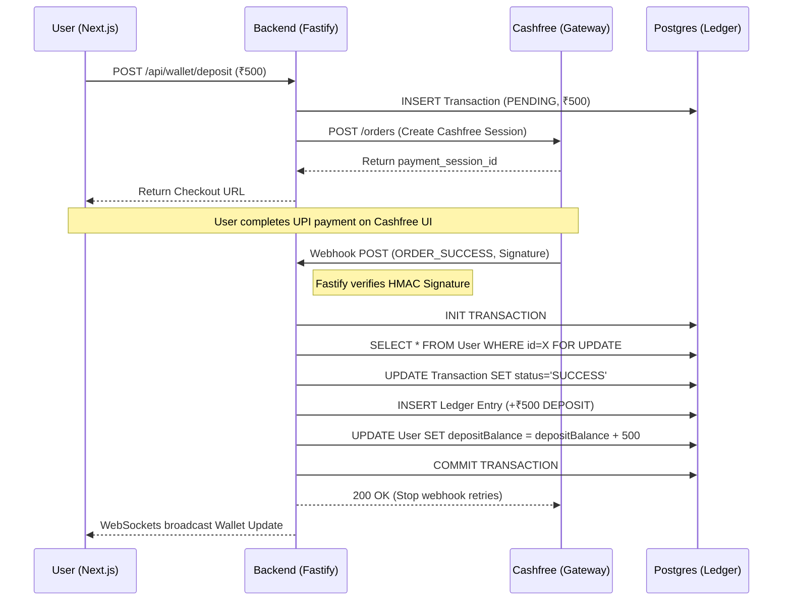
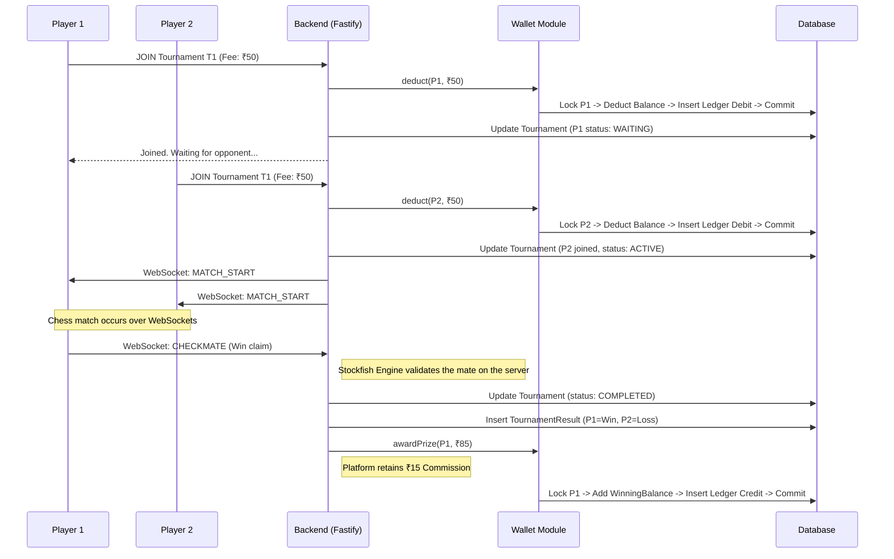
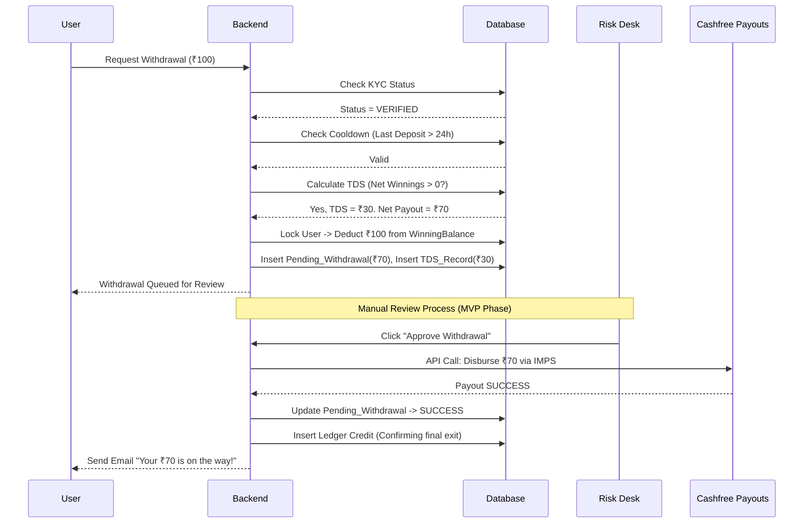

# 3.6 Data Flow Diagrams & 3.7 Sequence Diagrams

**Project Name:** Apex Arena (MVP)  
**Document Owner:** System Architect  
**Version:** 1.0.0  

---

## 1. Wallet Deposit Data Flow (Cashfree Integration)

## 2. Matchmaking & Prize Settlement Flow

## 3. Withdrawal & KYC Enforcement Flow

